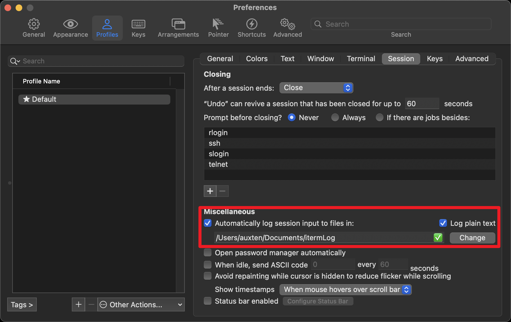

# AG Enhanced (age)

AG Enhanced (`age`) is an extension of `ag` (The Silver Searcher), adding support for searching within various compressed file formats and automatically compressing older log files. This project maintains the same usage patterns as `ag`, ensuring seamless integration for existing users with additional functionality.

## Features

- **Search within Compressed Files**: Enables searching within zip, gz, tgz, and zstd compressed files directly.
- **Automatic Log File Compression**: Automates the compression of `.log` files older than 7 days into `.log.zstd` to efficiently manage disk space.
- **Familiar `ag` Interface**: Utilizes the same command-line interface as `ag`, allowing users to integrate with no additional learning curve.

## Installation

### Prerequisites

Ensure that `ag` (The Silver Searcher) is installed on your system. For installation instructions, please refer to its [GitHub page](https://github.com/ggreer/the_silver_searcher).

### Installing AG Enhanced

Install `age` directly from the source using Go:

```bash
go install github.com/auxten/age@latest
```


This command fetches the latest version of `age` from the GitHub repository and installs it.

## Usage

Use `age` exactly like `ag`. Here are some example commands to get started:

Please make sure that the Go binary directory is in your `PATH`.
or you can use the following command:

```bash
export PATH=$PATH:$(go env GOPATH)/bin
```

```bash
# Perform a basic search
age "search pattern" /path/to/search

# Use additional `ag` options
age -i "search pattern" /path/to/search

# Search within compressed files
age "pattern" /path/with/compressed/files
```

## With iterm2

It's highly recommended to use iterm2 with age. iterm2 has a feature called "Semantic History" which allows you to search through the output of the terminal. 
This feature is very useful when you are searching for a specific command you ran in the past. But if you close the terminal, the history is gone.
You can let iterm2 save all the output of the terminal to a directory. This way you can search through the output of the terminal even after you close the terminal.

But the output of the terminal can be very large and take up a lot of disk space. age can help you with that. 
age can compress the log files automatically after a certain amount of time.

To activate the session logs, go to iTerm2 Preferences (⌘,), select the "Profiles" tab, then the "Session" tab. 
Under "Miscellaneous" you can specify a folder where log files for your sessions shall be saved in the future.



See: https://stackoverflow.com/a/35798807/896026

You can also make a shell function to search your iterm2 session logs:

```bash
agl() {
    age "$1" ~/Documents/itermLog # change the path to your iterm2 log directory
}
```

### Automatic Log File Compression

This functionality runs automatically. Any `.log` file older than 7 days is compressed to `.log.zstd`, and the original file is deleted.

## Supported File Formats

- **.zip**: Searches are conducted on each file within the zip archive.
- **.gz**: Gzipped files are decompressed on-the-fly and searched.
- **.zstd**: Files compressed with Zstandard are decompressed for searching.

## Contributing

Contributions are highly appreciated.

## License

This project is licensed under the Apache-2.0 license. See the [LICENSE](LICENSE) file for more details.
